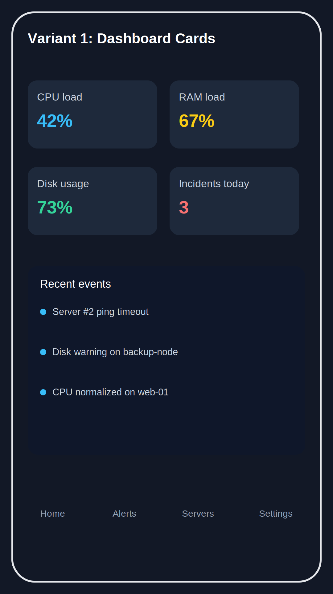
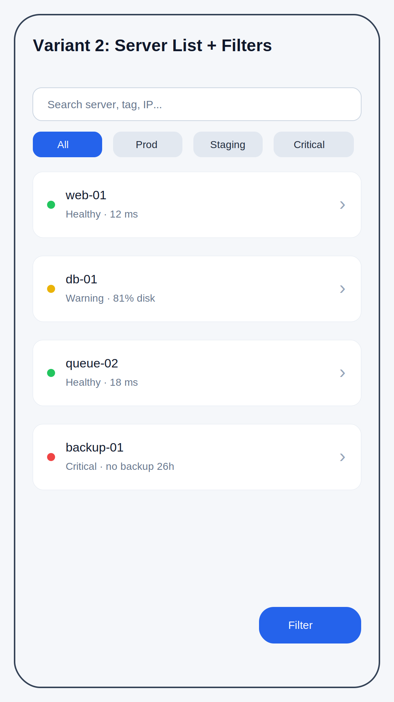
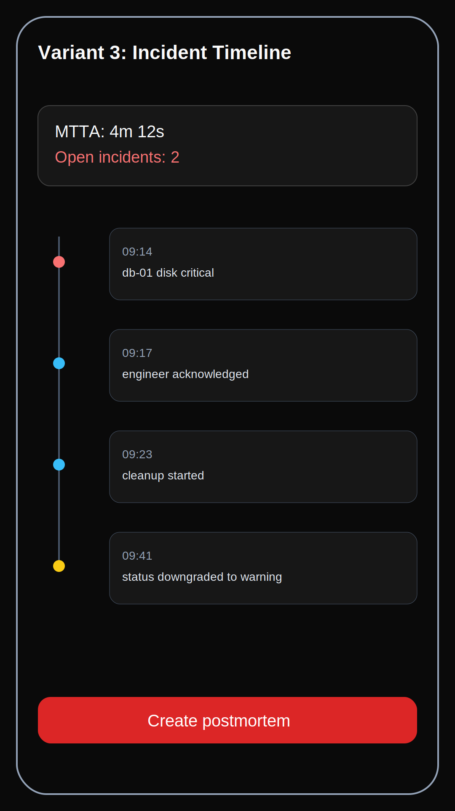

# Варианты интерфейса Android-приложения

Ниже три концепта экрана для мобильного мониторинга. Их можно использовать как основу для дальнейшего UI/UX-обсуждения.

## 1) Dashboard Cards (оперативный обзор)
**Когда подходит:** когда нужен быстрый контроль ключевых метрик и событий.

**Плюсы:**
- моментально видно состояние CPU/RAM/Disk;
- фокус на критичных инцидентах;
- удобно для on-call сценариев.

---

## 2) Server List + Filters (операционная работа)
**Когда подходит:** если основная задача — ежедневно работать со списком серверов и фильтрами.

**Плюсы:**
- быстрый поиск по серверу/тегу/IP;
- понятная сегментация (All/Prod/Staging/Critical);
- хорошо масштабируется на большое число хостов.

---

## 3) Incident Timeline (центр инцидентов)
**Когда подходит:** если важна хронология событий, SLA и разбор инцидентов.

**Плюсы:**
- прозрачная timeline-модель;
- легко отслеживать этапы реакции;
- удобно для постмортемов и аудита.

---

## Рекомендация
Для MVP логично стартовать с **варианта 2 (Server List + Filters)**, а экран **варианта 1** использовать как домашний дашборд. **Вариант 3** вынести в отдельный раздел Incident Center.
