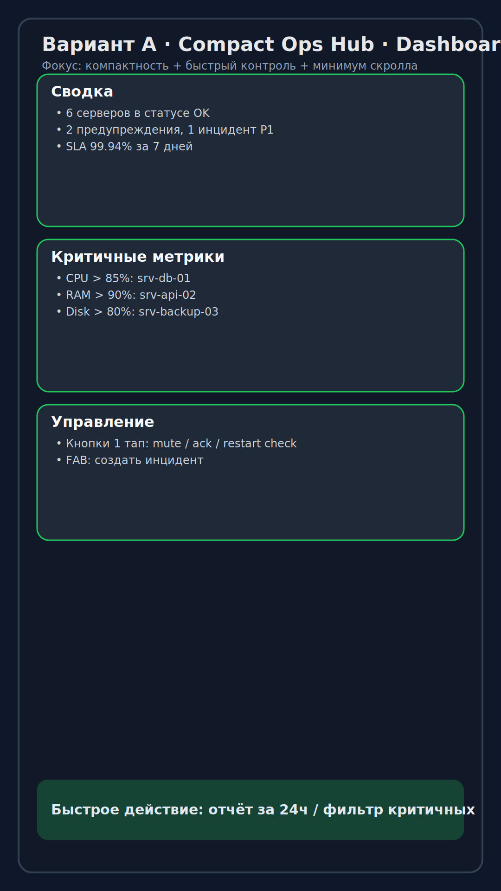
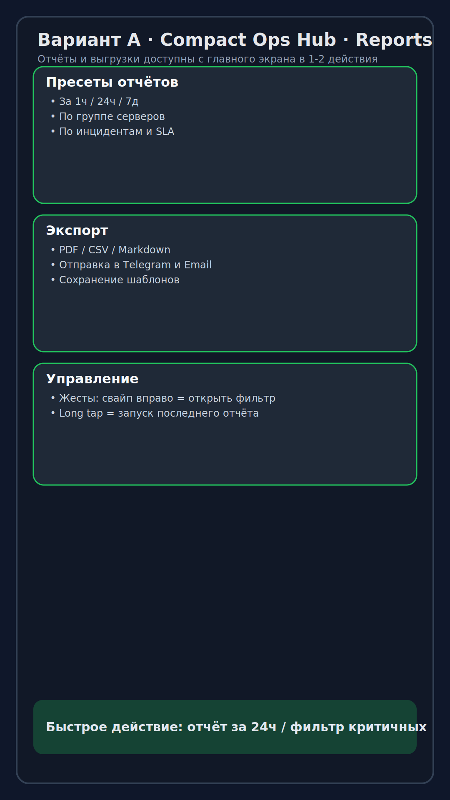
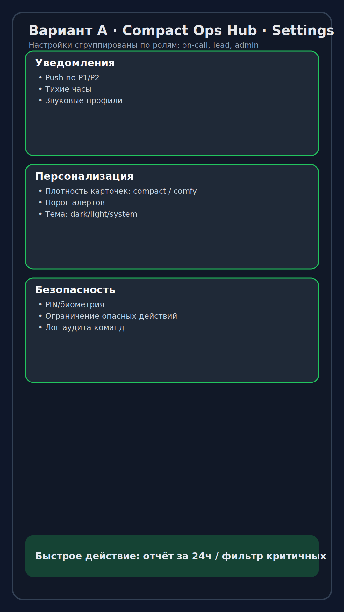
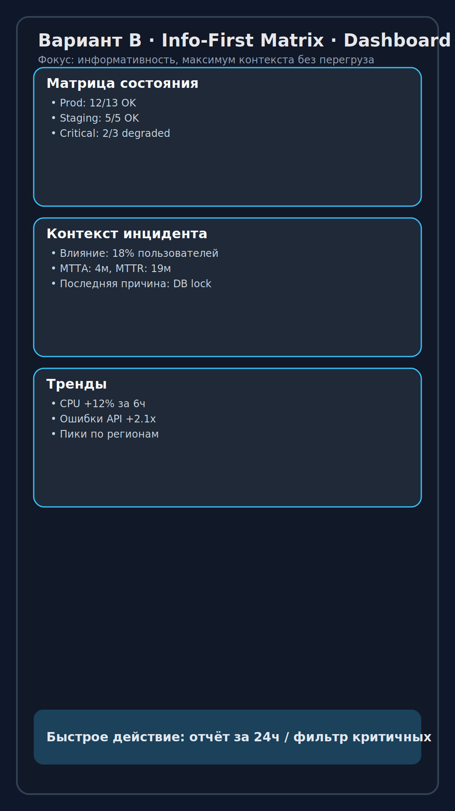
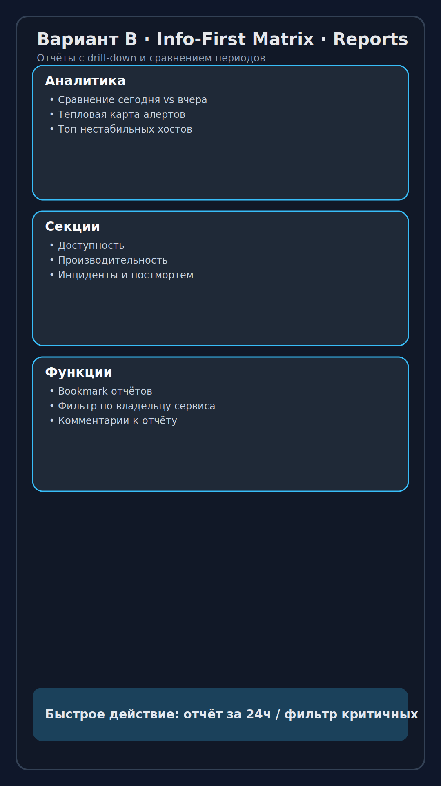
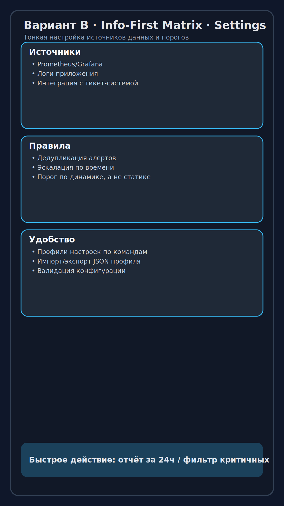
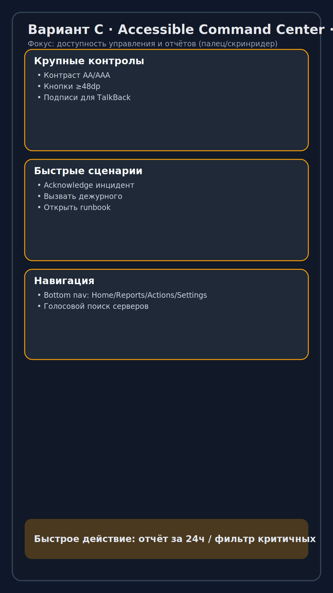
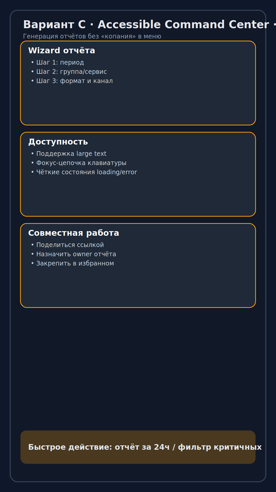
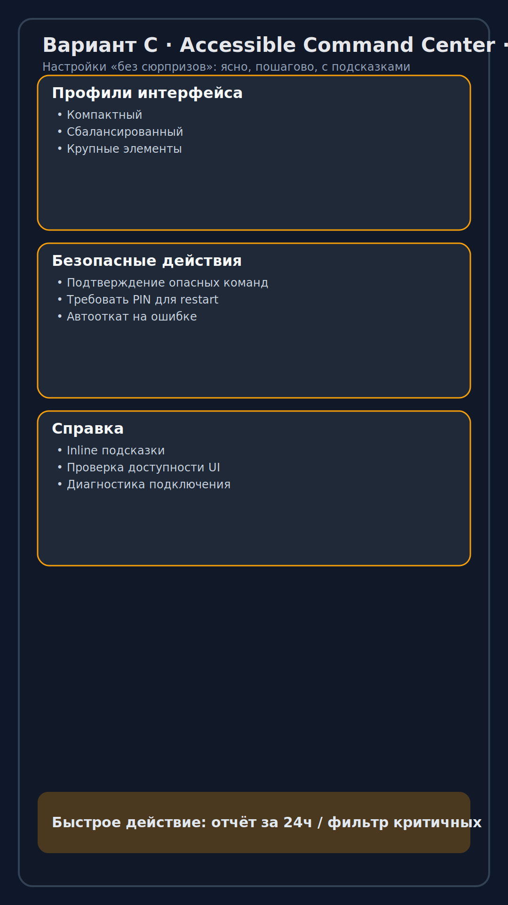

# Варианты интерфейса Android-приложения

Ниже собраны дополнительные UI-концепты с упором на:
- **компактность**;
- **информативность**;
- **доступное и быстрое управление + вызов отчётов**;
- **удобные настройки**.

## Вариант A — Compact Ops Hub
**Идея:** максимум полезной информации на одном экране, минимум скролла, быстрые действия для on-call.

### A1) Dashboard

### A2) Reports

### A3) Settings

---

## Вариант B — Info-First Matrix
**Идея:** высокая информативность, контекст инцидентов, метрики и тренды без потери читаемости.

### B1) Dashboard

### B2) Reports

### B3) Settings

---

## Вариант C — Accessible Command Center
**Идея:** крупные контролы, высокая доступность, простая навигация и отчёты в 1–3 действия.

### C1) Dashboard

### C2) Reports

### C3) Settings

---

## Рекомендация по следующему шагу
1. Взять **A** как базу для MVP (компактность + скорость реакций).
2. Добавить из **B** блоки аналитики и drill-down отчётов.
3. Применить из **C** паттерны доступности (размеры контролов, контраст, TalkBack-labels).
